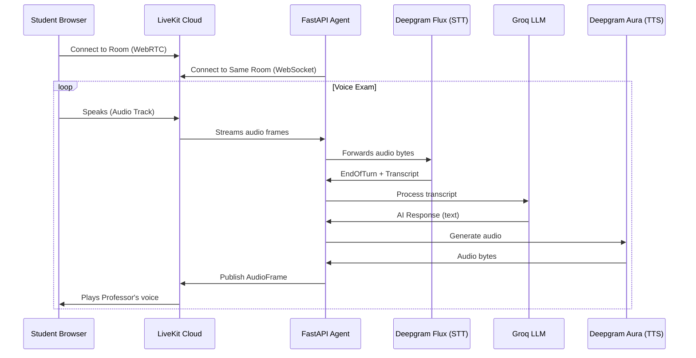

# Voxam Audio Transport Architecture

A deep-dive into how voice flows through the system, why it's safe for concurrent users, and a line-by-line walkthrough of the core files.

---

## 1. High-Level Flow



---

## 2. Why Multi-User is Safe

### 2.1. Room Isolation
Every exam session gets a **unique room**:
```python
# api.py (line 238)
room_name = f"exam-{user_id}-{os.urandom(4).hex()}"
```
- No two users share a room.
- LiveKit routes all audio for a room only to participants in that room.

### 2.2. Separate `audio_source` per Room
When the agent joins a room, it creates its own audio source:
```python
# realtime.py (line 116)
audio_source = rtc.AudioSource(48000, 1)  # Unique per room
audio_track = rtc.LocalAudioTrack.create_audio_track("agent_voice", audio_source)
await room.local_participant.publish_track(audio_track)
```
- `audio_source` is a **local variable** inside `start_exam_agent`.
- It is passed to `generate_and_stream_tts(text, audio_source)`.
- Two simultaneous exams have two different `audio_source` objects.

### 2.3. Stateless TTS Client
The Deepgram client is stateless:
```python
# realtime.py (line 32)
dg_tts_client = DeepgramClient(DEEPGRAM_API_KEY)

# Line 56: Each call is independent
response = dg_tts_client.speak.v1.audio.generate(...)
```
- The `response` object is unique per call.
- Two concurrent TTS calls don't share any state.

---

## 3. Code Walkthrough: `realtime.py`

### 3.1. Imports and Initialization
```python
from deepgram import AsyncDeepgramClient, DeepgramClient, SpeakOptions
```
- **`AsyncDeepgramClient`**: Used for STT (streaming WebSocket).
- **`DeepgramClient`**: Used for TTS (sync HTTP, but fast).
- **`SpeakOptions`**: Configures voice model, encoding, sample rate.

### 3.2. `generate_and_stream_tts` (Lines 34-90)
```python
async def generate_and_stream_tts(text: str, audio_source: rtc.AudioSource):
```
**Purpose**: Convert a sentence to audio and send it to the user.

| Step | Code | Explanation |
|------|------|-------------|
| 1 | `options = SpeakOptions(model="aura-orion-en", ...)` | Configure voice |
| 2 | `response = dg_tts_client.speak.v1.audio.generate(...)` | Call Deepgram API |
| 3 | `audio_data = response.stream.read()` | Get raw PCM bytes |
| 4 | `frame = rtc.AudioFrame(data=audio_data, ...)` | Wrap in LiveKit frame |
| 5 | `await audio_source.capture_frame(frame)` | Push to THIS user's track |

### 3.3. `start_exam_agent` (Lines 92-390)
**Purpose**: Main entrypoint for a voice exam session.

#### Room Connection
```python
room = rtc.Room()
await room.connect(LIVEKIT_URL, token)
```
- Creates a WebSocket connection to LiveKit.
- The `token` determines which room to join.

#### Publishing Agent Audio
```python
audio_source = rtc.AudioSource(48000, 1)
audio_track = rtc.LocalAudioTrack.create_audio_track("agent_voice", audio_source)
await room.local_participant.publish_track(audio_track)
```
- This is the "speaker" for the agent in this room.
- All audio frames pushed to `audio_source` go out on this track.

#### Receiving Student Audio
```python
@room.on("track_subscribed")
def on_track_subscribed(track, publication, participant):
    asyncio.create_task(handle_track_subscribed(track, ...))
```
- When the student's microphone track appears, we start processing it.

#### STT Pipeline
```python
async with dg_client.listen.v2.connect(...) as connection:
    async for event in audio_stream:
        await connection._send(pcm_bytes)
```
- We forward every audio frame from LiveKit to Deepgram Flux.
- When Deepgram detects "EndOfTurn", we process the transcript.

#### LLM Processing
```python
result = await loop.run_in_executor(executor, run_agent)
```
- The LangGraph exam agent is synchronous.
- We run it in a thread pool to not block the async event loop.

#### Sentence Buffering for TTS
```python
sentence_pattern = re.compile(r'([^.!?]+[.!?]+)')
sentences = sentence_pattern.findall(ai_response)
for sentence in sentences:
    await generate_and_stream_tts(sentence, audio_source)
```
- We split the AI response into sentences.
- Each sentence is converted to audio and sent immediately.
- This provides "progressive" playback instead of waiting for the full response.

---

## 4. Code Walkthrough: `api.py`

### 4.1. `/start-exam-session` (Lines 212-284)
**Purpose**: Create a room and spawn the agent.

```python
room_name = f"exam-{user_id}-{os.urandom(4).hex()}"
```
- Unique room name prevents cross-talk.

```python
agent_token = create_livekit_token("exam-agent", room_name)
student_token = create_livekit_token(user_id, room_name)
```
- Two separate tokens for the same room.
- The student uses theirs in the browser; the agent uses theirs on the server.

```python
asyncio.create_task(start_realtime_agent(...))
```
- The agent runs in the background.
- The API returns immediately so the student can connect.

---

## 5. Concurrency Safety Summary

| Entity | Scope | Shared? |
|--------|-------|---------|
| `room` | Per `start_exam_agent` call | ❌ No |
| `audio_source` | Per `start_exam_agent` call | ❌ No |
| `dg_tts_client` | Global | ✅ Yes (but stateless) |
| `response` from TTS | Per `generate_and_stream_tts` call | ❌ No |
| `transcript_buffer` | Per `handle_track_subscribed` | ❌ No |

**Conclusion**: Each user's voice exam runs in complete isolation. Audio packets can never "leak" to another user's room.
