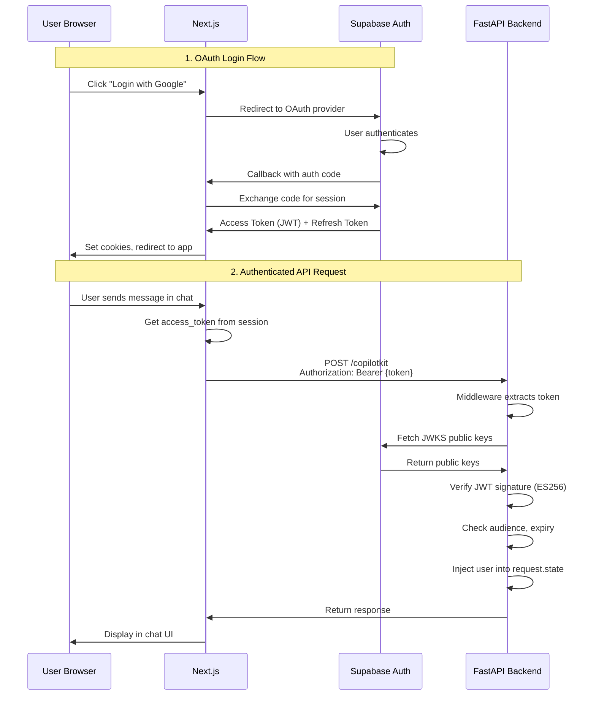
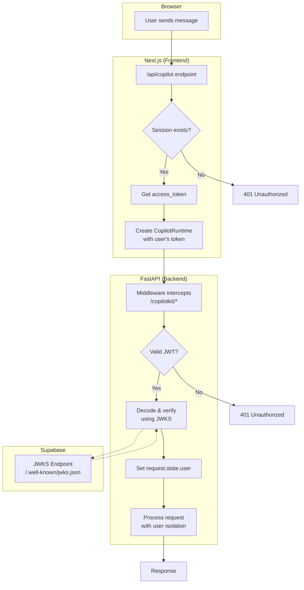

# Voxam Authentication Architecture

## Overview

This document explains the complete authentication flow between your Next.js frontend, Supabase Auth, and FastAPI backend.

---

## Architecture Diagram



---

## Component Breakdown

### 1. Next.js API Route (`/api/copilot/route.ts`)

This is the **bridge** between the frontend and the Python backend.

```typescript
// file:///Users/vasanth/voxam/nextjs/app/api/copilot/route.ts

export const POST = async (req: NextRequest) => {
  // Step 1: Create Supabase client with request cookies
  const supabase = await createClient();
  
  // Step 2: Get the current user's session
  const { data: { session } } = await supabase.auth.getSession();

  // Step 3: Block unauthenticated requests
  if (!session) {
    return new Response("Unauthorized", { status: 401 });
  }

  // Step 4: Create runtime with user's token forwarded to Python
  const runtime = new CopilotRuntime({
    agents: {
      'chat_agent': new LangGraphHttpAgent({
        url: "http://localhost:8000/copilotkit",
        headers: {
          // ⭐ KEY: Forward the user's JWT to Python backend
          "Authorization": `Bearer ${session.access_token}`
        }
      }),
    },
  });

  return handleRequest(req);
};
```

**Key Points:**
- Next.js validates the session via Supabase SDK (uses cookies)
- The `access_token` is extracted and forwarded to Python
- Each request creates a fresh runtime (fixes the race condition!)

---

### 2. FastAPI Middleware (`api.py`)

The middleware intercepts ALL requests to `/copilotkit` and verifies the JWT.

```python
# file:///Users/vasanth/voxam/python/api.py

@app.middleware("http")
async def verify_copilot_request(request: Request, call_next):
    if request.url.path.startswith("/copilotkit"):
        try:
            # Step 1: Extract Authorization header
            auth = request.headers.get("Authorization")
            if not auth:
                return JSONResponse(status_code=401, 
                    content={"detail": "Missing Authorization header"})
            
            # Step 2: Parse "Bearer <token>"
            scheme, _, token = auth.partition(" ")
            if scheme.lower() != "bearer":
                return JSONResponse(status_code=401, 
                    content={"detail": "Invalid authentication scheme"})
            
            # Step 3: Get public key from Supabase JWKS
            jwks_client = get_jwks_client()
            signing_key = jwks_client.get_signing_key_from_jwt(token)
            
            # Step 4: Verify and decode JWT
            payload = jwt.decode(
                token, 
                signing_key.key, 
                algorithms=["ES256"],      # ECC P-256 algorithm
                audience="authenticated",  # Must match Supabase audience
                options={"verify_exp": True}
            )
            
            # Step 5: Make user available to request handlers
            request.state.user = payload
            
        except Exception as e:
            print(f"Auth failed: {e}")
            return JSONResponse(status_code=401, 
                content={"detail": "Invalid authentication credentials"})
            
    return await call_next(request)
```

**Middleware Flow:**
```
Request arrives → Check path → Extract token → Verify signature → Decode payload → Attach to request
```

---

### 3. Security Module (`security.py`)

Handles JWKS fetching and JWT verification logic.

```python
# file:///Users/vasanth/voxam/python/security.py

# JWKS URL fetched from environment
SUPABASE_JWKS_URL = os.getenv("SUPABASE_JWKS_URL")
# Example: https://tjqgccjublbdzurdpjxn.supabase.co/auth/v1/.well-known/jwks.json

# Cached JWKS client (avoids fetching keys on every request)
_jwks_client = None

def get_jwks_client():
    """Get or create a cached JWKS client."""
    global _jwks_client
    if _jwks_client is None:
        _jwks_client = PyJWKClient(SUPABASE_JWKS_URL)
    return _jwks_client
```

**JWKS (JSON Web Key Set) Explained:**
- Supabase publishes its **public keys** at a well-known URL
- Your backend fetches these keys to verify JWT signatures
- Keys are cached for performance (not fetched on every request)
- Supports key rotation (JWKS contains multiple keys)

---

## JWT Token Structure

When a user logs in, Supabase generates a JWT like this:

```json
{
  "header": {
    "alg": "ES256",        // Algorithm: Elliptic Curve (P-256)
    "typ": "JWT",
    "kid": "2A5066A7-..."  // Key ID (matches a key in JWKS)
  },
  "payload": {
    "sub": "abc123-user-id",    // User ID
    "email": "user@example.com",
    "aud": "authenticated",      // Audience (must match in verification)
    "exp": 1702123456,           // Expiry timestamp
    "iat": 1702119856,           // Issued at
    "role": "authenticated"
  },
  "signature": "..." // Cryptographic signature
}
```

**Verification Process:**
1. Extract `kid` from header → Find matching key in JWKS
2. Use public key to verify signature is valid
3. Check `aud` matches "authenticated"
4. Check `exp` is in the future (not expired)
5. If all pass → User is authenticated

---

## The Race Condition Bug (FIXED)

### What Was the Problem?

In an earlier version, the CopilotKit runtime was created **globally** (outside the request handler):

```typescript
// ❌ BAD: Global runtime with hardcoded/stale token
const runtime = new CopilotRuntime({
  agents: {
    'chat_agent': new LangGraphHttpAgent({
      url: "http://localhost:8000/copilotkit",
      headers: {
        "Authorization": `Bearer ${SOME_TOKEN}`  // Whose token?!
      }
    }),
  },
});

export const POST = async (req: NextRequest) => {
  return handleRequest(req);  // Uses global runtime
};
```

### Why Was This Dangerous?

**Scenario:**
1. User A logs in at 10:00 → Their token is set in the global runtime
2. User B logs in at 10:01 → Their token SHOULD replace it... but timing issues!
3. User A makes a request at 10:02 → Might use User B's token!
4. User B's data is accessed by User A's request 💀

```
┌────────────────────────────────────────────────────────────┐
│  RACE CONDITION TIMELINE                                   │
├────────────────────────────────────────────────────────────┤
│  10:00:00  User A logs in → Token A stored in global       │
│  10:00:01  User B logs in → Token B stored in global       │
│  10:00:02  User A request → Uses Token B (WRONG!)          │
│                                                            │
│  Result: User A can access User B's documents!             │
└────────────────────────────────────────────────────────────┘
```

### The Fix

Create the runtime **inside each request handler** with the **current user's token**:

```typescript
// ✅ GOOD: Fresh runtime per request with user's own token
export const POST = async (req: NextRequest) => {
  const supabase = await createClient();
  const { data: { session } } = await supabase.auth.getSession();
  
  if (!session) return new Response("Unauthorized", { status: 401 });

  // Create runtime INSIDE the request with THIS user's token
  const runtime = new CopilotRuntime({
    agents: {
      'chat_agent': new LangGraphHttpAgent({
        url: "http://localhost:8000/copilotkit",
        headers: {
          "Authorization": `Bearer ${session.access_token}`  // ✅ Correct user!
        }
      }),
    },
  });

  return handleRequest(req);
};
```

**Now each request uses its own user's token - no leakage possible.**

---

## Complete Request Flow



---

## Key Security Principles

| Principle | Implementation |
|-----------|----------------|
| **Token Isolation** | Each request creates fresh runtime with user's own token |
| **Signature Verification** | JWKS + ES256 ensures token wasn't tampered |
| **Expiry Checks** | `verify_exp=True` rejects expired tokens |
| **Audience Validation** | Only tokens with `aud: "authenticated"` accepted |
| **Key Rotation** | JWKS supports multiple keys for seamless rotation |

---

## Files Reference

| File | Purpose |
|------|---------|
| [route.ts](file:///Users/vasanth/voxam/nextjs/app/api/copilot/route.ts) | Next.js API route - extracts token, forwards to Python |
| [api.py](file:///Users/vasanth/voxam/python/api.py) | FastAPI middleware - verifies JWT on every request |
| [security.py](file:///Users/vasanth/voxam/python/security.py) | JWKS client and token verification logic |
