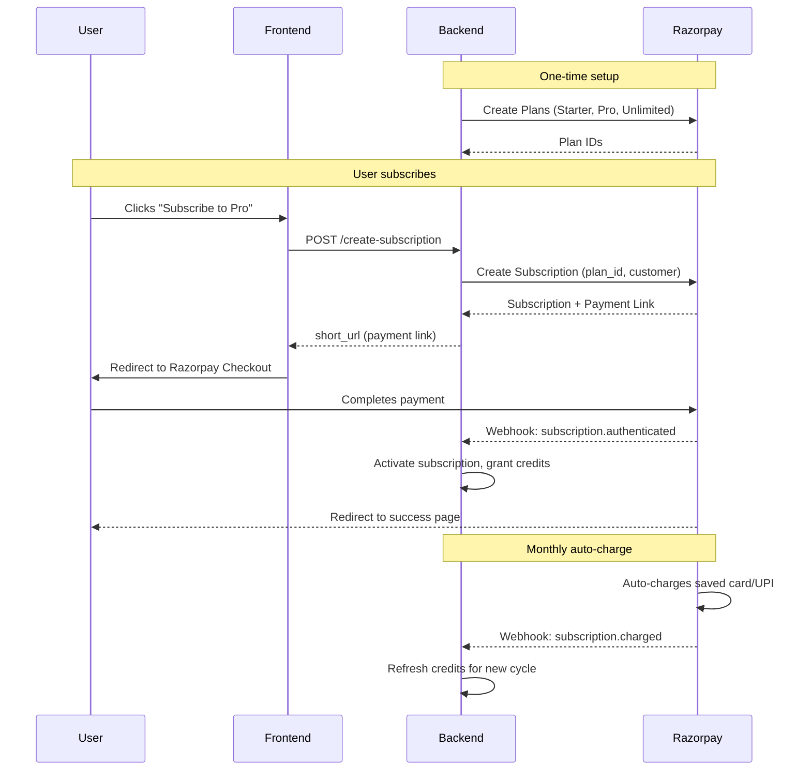

# Razorpay Subscriptions - Implementation Plan for Voxam

## How Razorpay Subscriptions Works



---

## Core Concepts

| Concept | Description |
|---------|-------------|
| **Plan** | A template defining price (₹299/₹599/₹999), billing cycle (monthly), and name |
| **Subscription** | Links a User to a Plan. Razorpay handles auto-charging |
| **Invoice** | Auto-generated by Razorpay for each billing cycle |
| **Webhook** | HTTP POST from Razorpay to your server on events |

---

## Our Plans (to create in Razorpay Dashboard)

| Plan Name | Plan ID (we'll get) | Amount | Period | Interval |
|-----------|---------------------|--------|--------|----------|
| **Starter** | `plan_starter_xxx` | ₹299 | monthly | 1 |
| **Pro** | `plan_pro_xxx` | ₹599 | monthly | 1 |
| **Unlimited** | `plan_unlimited_xxx` | ₹999 | monthly | 1 |

---

## Database Schema (New Tables)

```prisma
// ========== SUBSCRIPTION & BILLING ==========

model SubscriptionPlan {
  id          String   @id @default(uuid())
  name        String   // "starter", "pro", "unlimited"
  displayName String   // "Starter Plan"
  razorpayPlanId String @unique // "plan_xxx" from Razorpay
  priceInr    Int      // 299, 599, 999 (in rupees)
  
  // Limits per billing cycle
  voiceMinutes   Int   // 90, 180, 400
  chatMessages   Int   // 200, 500, 2000
  documentPages  Int   // 50, 150, 300
  examReports    Int   // 3, 10, 30
  
  isActive    Boolean  @default(true)
  createdAt   DateTime @default(now())
  updatedAt   DateTime @updatedAt
  
  subscriptions Subscription[]
}

model Subscription {
  id                    String   @id @default(uuid())
  razorpaySubscriptionId String  @unique // "sub_xxx" from Razorpay
  razorpayCustomerId    String?  // "cust_xxx" from Razorpay
  
  status      SubscriptionStatus @default(CREATED)
  
  currentPeriodStart DateTime?
  currentPeriodEnd   DateTime?
  
  createdAt   DateTime @default(now())
  updatedAt   DateTime @updatedAt
  cancelledAt DateTime?
  
  // Relations
  userId String
  user   User @relation(fields: [userId], references: [id])
  
  planId String
  plan   SubscriptionPlan @relation(fields: [planId], references: [id])
  
  credits UserCredits?
  transactions Transaction[]
  
  @@index([userId])
  @@index([razorpaySubscriptionId])
}

enum SubscriptionStatus {
  CREATED      // Just created, not paid yet
  AUTHENTICATED // First payment done, active
  ACTIVE       // Recurring payments working
  PENDING      // Payment failed, retrying
  HALTED       // Payment failed multiple times
  CANCELLED    // User cancelled
  COMPLETED    // Ended (fixed cycles)
  EXPIRED      // Past end date
}

model UserCredits {
  id        String   @id @default(uuid())
  
  // Current usage (resets each billing cycle)
  voiceMinutesUsed   Int @default(0)
  chatMessagesUsed   Int @default(0)
  documentPagesUsed  Int @default(0)
  examReportsUsed    Int @default(0)
  
  // Limits (copied from plan for fast access)
  voiceMinutesLimit  Int @default(0)
  chatMessagesLimit  Int @default(0)
  documentPagesLimit Int @default(0)
  examReportsLimit   Int @default(0)
  
  cycleStartDate DateTime
  cycleEndDate   DateTime
  
  createdAt DateTime @default(now())
  updatedAt DateTime @updatedAt
  
  // Relations
  userId String @unique
  user   User @relation(fields: [userId], references: [id])
  
  subscriptionId String @unique
  subscription   Subscription @relation(fields: [subscriptionId], references: [id])
}

model Transaction {
  id        String   @id @default(uuid())
  
  razorpayPaymentId  String? @unique // "pay_xxx"
  razorpayInvoiceId  String? // "inv_xxx"
  razorpaySignature  String?
  
  amount    Int      // Amount in paise (29900 = ₹299)
  currency  String   @default("INR")
  status    TransactionStatus
  
  type      TransactionType
  
  metadata  Json?    // Store any extra info
  
  createdAt DateTime @default(now())
  updatedAt DateTime @updatedAt
  
  // Relations
  userId String
  user   User @relation(fields: [userId], references: [id])
  
  subscriptionId String?
  subscription   Subscription? @relation(fields: [subscriptionId], references: [id])
  
  @@index([userId])
  @@index([razorpayPaymentId])
}

enum TransactionStatus {
  PENDING
  SUCCESS
  FAILED
  REFUNDED
}

enum TransactionType {
  SUBSCRIPTION_CREATED   // First payment
  SUBSCRIPTION_CHARGED   // Recurring payment
  SUBSCRIPTION_CANCELLED // Refund on cancel
  TOP_UP                 // Extra credits purchase (future)
}
```

---

## Webhook Events We Handle

| Event | When | Our Action |
|-------|------|------------|
| `subscription.authenticated` | First payment success | Set status=ACTIVE, create credits |
| `subscription.charged` | Monthly renewal success | Reset credits for new cycle |
| `subscription.pending` | Payment retry scheduled | Set status=PENDING |
| `subscription.halted` | Multiple payment failures | Set status=HALTED, notify user |
| `subscription.cancelled` | User cancels | Set status=CANCELLED |

---

## API Endpoints to Implement

### Backend (FastAPI or Next.js API Routes)

| Endpoint | Method | Purpose |
|----------|--------|---------|
| `/api/subscription/plans` | GET | List available plans |
| `/api/subscription/create` | POST | Create subscription, return payment link |
| `/api/subscription/status` | GET | Get user's current subscription |
| `/api/subscription/cancel` | POST | Cancel subscription |
| `/api/webhooks/razorpay` | POST | Handle Razorpay webhooks |
| `/api/credits` | GET | Get user's current credits |

---

## Frontend Flow

```
┌─────────────────────────────────────────────────────────────┐
│                     Pricing Page                             │
├─────────────────────────────────────────────────────────────┤
│  ┌─────────────┐  ┌─────────────┐  ┌─────────────┐         │
│  │   Starter   │  │     Pro     │  │  Unlimited  │         │
│  │   ₹299/mo   │  │   ₹599/mo   │  │   ₹999/mo   │         │
│  │             │  │             │  │             │         │
│  │ 90 min voice│  │180 min voice│  │400 min voice│         │
│  │ 200 chat    │  │500 chat     │  │2000 chat    │         │
│  │ 50 pages    │  │150 pages    │  │300 pages    │         │
│  │             │  │             │  │             │         │
│  │ [Subscribe] │  │ [Subscribe] │  │ [Subscribe] │         │
│  └─────────────┘  └─────────────┘  └─────────────┘         │
└─────────────────────────────────────────────────────────────┘
                          │
                          ▼ Click Subscribe
┌─────────────────────────────────────────────────────────────┐
│              Razorpay Checkout (hosted)                      │
│  ┌─────────────────────────────────────────────────────┐    │
│  │  Pay ₹599 for Voxam Pro Plan                         │    │
│  │                                                       │    │
│  │  [UPI]  [Cards]  [NetBanking]  [Wallets]             │    │
│  │                                                       │    │
│  │  [Pay Now]                                           │    │
│  └─────────────────────────────────────────────────────┘    │
└─────────────────────────────────────────────────────────────┘
                          │
                          ▼ Payment Success
┌─────────────────────────────────────────────────────────────┐
│                  Success Page                                │
│                                                              │
│  ✅ You're now on the Pro Plan!                             │
│                                                              │
│  Your credits:                                               │
│  • 180 minutes voice exam                                   │
│  • 500 chat messages                                        │
│  • 150 document pages                                       │
│                                                              │
│  [Go to Dashboard]                                          │
└─────────────────────────────────────────────────────────────┘
```

---

## Implementation Steps

### Phase 1: Setup (Day 1)
- [ ] Create Razorpay account and get API keys
- [ ] Create Plans in Razorpay Dashboard
- [ ] Add schema to Prisma, run migrations
- [ ] Store Plan IDs in database

### Phase 2: Backend (Day 2-3)
- [ ] Install `razorpay` npm package
- [ ] Create subscription API endpoints
- [ ] Implement webhook handler with signature verification
- [ ] Create credit checking middleware

### Phase 3: Frontend (Day 3-4)
- [ ] Create pricing page
- [ ] Implement subscription flow
- [ ] Add credit usage display in dashboard
- [ ] Add "Manage Subscription" settings page

### Phase 4: Usage Tracking (Day 4-5)
- [ ] Track voice minutes in exam agent
- [ ] Track chat messages in chat agent
- [ ] Track document pages in ingestion
- [ ] Enforce limits and show warnings

---

## Environment Variables Needed

```env
# Razorpay
RAZORPAY_KEY_ID=rzp_test_xxxx
RAZORPAY_KEY_SECRET=xxxx
RAZORPAY_WEBHOOK_SECRET=xxxx

# Plan IDs (after creating in dashboard)
RAZORPAY_PLAN_STARTER=plan_xxxx
RAZORPAY_PLAN_PRO=plan_xxxx
RAZORPAY_PLAN_UNLIMITED=plan_xxxx
```

---

## Security Checklist

- [ ] Verify webhook signatures using `razorpay-webhook-secret`
- [ ] Use HTTPS for webhook endpoint
- [ ] Never trust client-side subscription status
- [ ] Check credits server-side before allowing actions
- [ ] Log all transactions for audit trail
