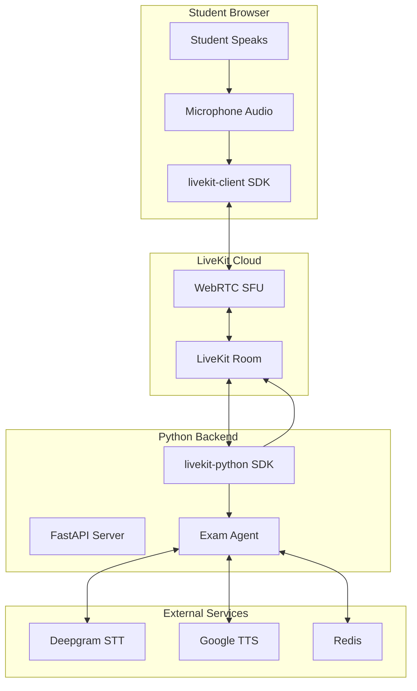
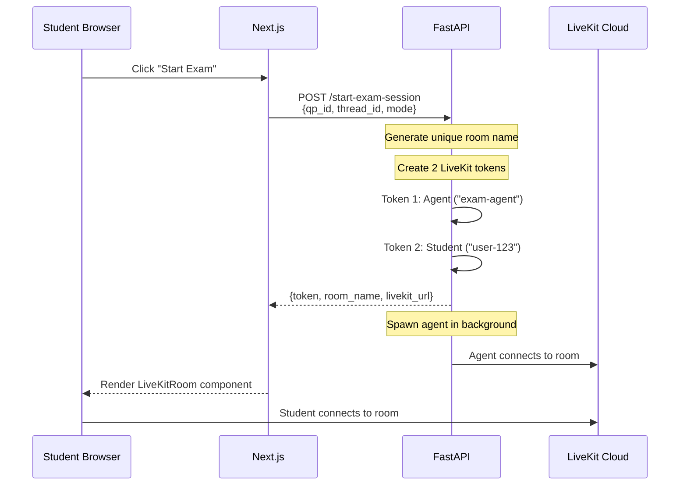
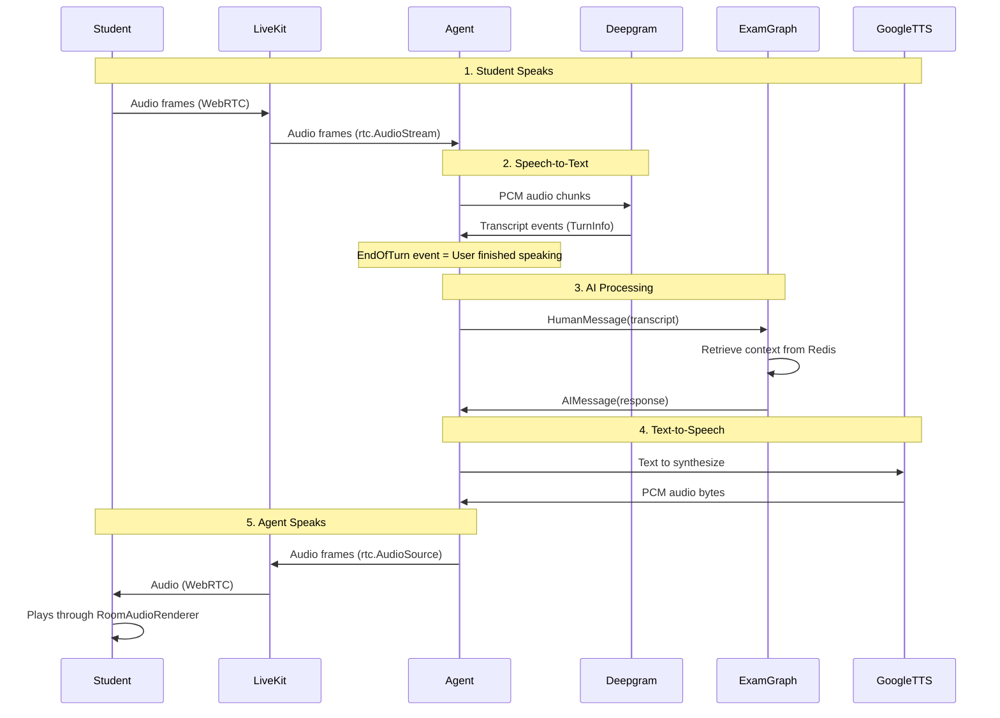
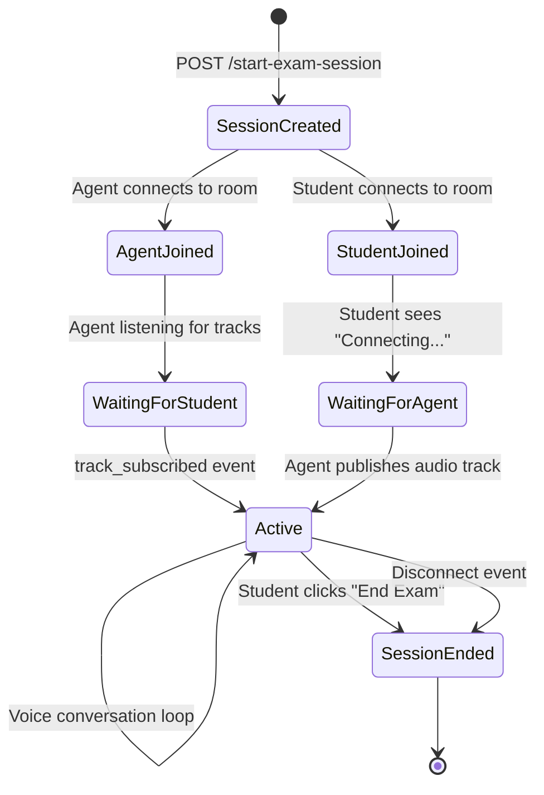

# Voice Exam Architecture: LiveKit Integration

## Overview

This document explains the complete voice exam flow from the Next.js frontend through LiveKit to the Python exam agent, with focus on how LiveKit coordinates real-time audio communication.

---

## High-Level Architecture



---

## The Complete Flow

### Step 1: Session Initiation

When student clicks "Start Exam", the Next.js frontend calls the FastAPI backend to create a session:



---

### Step 2: Token Generation

LiveKit uses **short-lived JWTs** to authorize room access. Your backend generates these:

```python
# file:///Users/vasanth/voxam/python/api.py

def create_livekit_token(identity: str, room_name: str) -> str:
    """
    Create a LiveKit access token for a participant
    Room is automatically created when first participant joins
    """
    token = (
        api.AccessToken(LIVEKIT_API_KEY, LIVEKIT_API_SECRET)
        .with_identity(identity)       # Who is this? (e.g., "exam-agent" or "student-123")
        .with_grants(
            api.VideoGrants(
                room=room_name,        # Which room can they join?
                room_join=True,        # Can join the room?
                can_publish=True,      # Can send audio/video?
                can_subscribe=True,    # Can receive audio/video?
            )
        )
    )
    return token.to_jwt()
```

**Key Points:**
- Each participant gets their own token with their identity
- Tokens are signed with your `LIVEKIT_API_SECRET` (never exposed to client)
- Tokens are short-lived and room-scoped for security
- **Room auto-creates** when the first participant joins

---

### Step 3: Room Connection (Both Sides)

#### Student Side (Next.js + livekit-client)

```tsx
// file:///Users/vasanth/voxam/nextjs/app/authenticated/exam/page.tsx

// Create room instance
const [room] = useState(() => new Room({
  adaptiveStream: true,   // Optimize bandwidth
  dynacast: true,         // Optimize SFU routing
}))

// Connect to room
<LiveKitRoom
  serverUrl={sessionInfo.livekit_url}  // e.g., "wss://your-app.livekit.cloud"
  token={sessionInfo.token}             // Student's JWT from backend
  connect={true}
  audio={true}                          // Enable microphone
  video={false}                         // No video needed
  onDisconnected={endExam}
>
  <ExamRoomContent />
  <RoomAudioRenderer />  {/* Plays agent's audio */}
</LiveKitRoom>
```

#### Agent Side (Python + livekit-sdk)

```python
# file:///Users/vasanth/voxam/python/agents/realtime.py

# Create and connect to room
room = rtc.Room()

room.on("disconnected", on_disconnected)

await room.connect(LIVEKIT_URL, token)  # Agent's JWT
print(f"🤖 Agent joined room: {room_name}")

# Create audio source for TTS output
audio_source = rtc.AudioSource(48000, 1)  # 48kHz, mono
audio_track = rtc.LocalAudioTrack.create_audio_track("agent_voice", audio_source)

# Publish agent's audio track so student can hear it
await room.local_participant.publish_track(audio_track)
```

---

## LiveKit Room Mechanics

### What is a LiveKit Room?

A **Room** is a virtual space where participants can:
- **Publish** audio/video tracks
- **Subscribe** to other participants' tracks
- Communicate in real-time via WebRTC

```
┌─────────────────────────────────────────────────────────────────┐
│                     LIVEKIT ROOM                                │
│                  "exam-user123-abc123"                          │
│                                                                 │
│   ┌───────────────────┐         ┌───────────────────┐           │
│   │     STUDENT       │         │    EXAM AGENT     │           │
│   │   identity:       │         │   identity:       │           │
│   │   "user-123"      │         │   "exam-agent"    │           │
│   │                   │         │                   │           │
│   │   📤 Publishes:   │         │   📤 Publishes:   │           │
│   │   - microphone    │ ──────▶ │   (subscribes)    │           │
│   │                   │         │                   │           │
│   │   📥 Subscribes:  │         │   - agent_voice   │           │
│   │   (receives TTS)  │ ◀────── │   (TTS audio)     │           │
│   └───────────────────┘         └───────────────────┘           │
│                                                                 │
└─────────────────────────────────────────────────────────────────┘
```

### Track Types

| Track | Direction | Purpose |
|-------|-----------|---------|
| Student Microphone | Student → Agent | Voice input for STT |
| Agent Voice | Agent → Student | TTS output response |

---

## Audio Processing Pipeline

### The Complete Voice Loop



---

## Detailed Code Walkthrough

### 1. Subscribing to Student Audio

When a student joins and publishes their microphone, the agent receives the track:

```python
# file:///Users/vasanth/voxam/python/agents/realtime.py

@room.on("track_subscribed")
def on_track_subscribed(
    track: rtc.Track,
    publication: rtc.RemoteTrackPublication,
    participant: rtc.RemoteParticipant
):
    # Create async task to handle the track
    asyncio.create_task(handle_track_subscribed(track, publication, participant))

async def handle_track_subscribed(track, publication, participant):
    if track.kind != rtc.TrackKind.KIND_AUDIO:
        return  # We only care about audio
    
    print(f"🎧 Received audio track from {participant.identity}")
    
    # Create audio stream to receive frames
    audio_stream = rtc.AudioStream(track)
    
    async for event in audio_stream:
        frame = event.frame
        # frame.data = raw PCM bytes
        # frame.sample_rate = usually 48000
        # frame.num_channels = 1 or 2
```

### 2. Streaming to Deepgram Flux

Audio frames are forwarded to Deepgram for real-time transcription:

```python
# Connect to Deepgram Flux v2
async with dg_client.listen.v2.connect(
    model="flux-general-en",      # Flux model for low-latency
    encoding="linear16",          # PCM-16 format
    sample_rate="48000",          # Match LiveKit's rate
    eot_threshold="0.7",          # End-of-turn sensitivity
    eot_timeout_ms="5000"         # 5s silence = turn end
) as connection:
    
    # Message handler for transcription events
    def on_message(message):
        if message.type == "TurnInfo":
            if message.event == "EndOfTurn":
                # User finished speaking!
                full_transcript = message.transcript
                asyncio.create_task(process_complete_transcript(full_transcript))
            
            elif message.event == "EagerEndOfTurn":
                # User might be done (for speculative processing)
                pass
    
    # Forward audio frames to Deepgram
    async for event in audio_stream:
        frame = event.frame
        pcm_bytes = frame.data.tobytes()
        await connection._send(pcm_bytes)
```

### 3. Deepgram Flux Events

Deepgram Flux v2 provides intelligent turn detection:

| Event | Meaning | Action |
|-------|---------|--------|
| `StartOfTurn` | User started speaking | Could interrupt agent |
| `Update` | Partial transcript available | Show live captions (optional) |
| `EagerEndOfTurn` | Medium confidence turn ended | Speculatively start LLM |
| `TurnResumed` | User kept speaking after eager | Cancel speculative work |
| `EndOfTurn` | High confidence turn ended | **Process transcript!** |

### 4. Processing with Exam Agent

Once we have the complete transcript:

```python
async def process_complete_transcript(full_transcript: str):
    # Create exam state
    exam_state = ExamState(
        messages=[HumanMessage(content=full_transcript)],
        thread_id=thread_id,
        qp_id=qp_id,
        mode=mode  # "exam" or "learn"
    )
    
    # Configuration for Redis checkpointer
    config = {"configurable": {"thread_id": thread_id}}
    
    # Run agent (sync invoke in executor)
    result = exam_agent_graph.invoke(exam_state, config=config)
    
    # Extract AI response
    ai_response = result["messages"][-1].content
```

### 5. Text-to-Speech with Google Cloud

Convert the AI response to audio:

```python
async def generate_and_stream_tts(text: str, audio_source: rtc.AudioSource):
    # Configure synthesis
    audio_config = texttospeech.AudioConfig(
        audio_encoding=texttospeech.AudioEncoding.LINEAR16,
        sample_rate_hertz=48000,  # Match LiveKit's rate
    )
    
    voice = texttospeech.VoiceSelectionParams(
        name="en-US-Chirp3-HD-Achird",  # High-quality voice
        language_code="en-US",
    )
    
    # Synthesize
    response = tts_client.synthesize_speech(
        input=texttospeech.SynthesisInput(text=text),
        voice=voice,
        audio_config=audio_config
    )
    
    audio_data = response.audio_content  # PCM bytes
    
    # Create AudioFrame for LiveKit
    frame = rtc.AudioFrame(
        data=audio_data,
        sample_rate=48000,
        num_channels=1,
        samples_per_channel=len(audio_data) // 2
    )
    
    # Send to LiveKit → Student
    await audio_source.capture_frame(frame)
```

---

## Sentence-Level Streaming

For natural conversation, responses are streamed sentence by sentence:

```python
# Split response into sentences
sentence_pattern = re.compile(r'([^.!?]+[.!?]+)')
sentences = sentence_pattern.findall(ai_response)

# Stream TTS for each sentence
for sentence in sentences:
    if sentence.strip():
        await generate_and_stream_tts(sentence, audio_source)
        # Student hears each sentence as it's generated
```

This creates a more natural flow where the student starts hearing the response while later sentences are still being synthesized.

---

## Complete Session Lifecycle



---

## Key Configuration

### Environment Variables

```bash
# LiveKit
LIVEKIT_URL=wss://your-app.livekit.cloud
LIVEKIT_API_KEY=APIdxxxxxxxxx
LIVEKIT_API_SECRET=xxxxxxxxxxxxxxxxxxxxx

# Deepgram
DEEPGRAM_API_KEY=xxxxxxxxxxxxxxxxx

# Google Cloud TTS
GOOGLE_APPLICATION_CREDENTIALS=/path/to/service-account.json
```

### Audio Format Consistency

All components use **48kHz mono PCM-16**:

| Component | Sample Rate | Channels | Format |
|-----------|-------------|----------|--------|
| LiveKit (default) | 48000 Hz | 1 (mono) | PCM-16 |
| Deepgram Flux | 48000 Hz | 1 (mono) | linear16 |
| Google TTS | 48000 Hz | 1 (mono) | LINEAR16 |

---

## Files Reference

| File | Purpose |
|------|---------|
| [page.tsx](file:///Users/vasanth/voxam/nextjs/app/authenticated/exam/page.tsx) | Next.js exam UI with LiveKitRoom |
| [api.py](file:///Users/vasanth/voxam/python/api.py) | Session creation and token generation |
| [realtime.py](file:///Users/vasanth/voxam/python/agents/realtime.py) | Agent implementation with STT/TTS |
| [exam_agent.py](file:///Users/vasanth/voxam/python/agents/exam_agent.py) | LangGraph exam logic |
